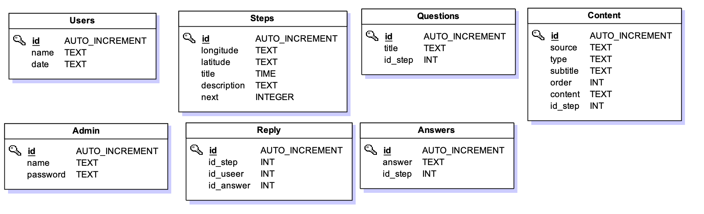

# semaineFinal

> My neat Nuxt.js project

## Build Setup

``` bash
# install dependencies
$ npm install

# serve with hot reload at localhost:3000
$ npm run dev

# build for production and launch server
$ npm run build
$ npm start

# generate static project
$ npm run generate
```

For detailed explanation on how things work, checkout [Nuxt.js docs](https://nuxtjs.org).

## DB



### Install the DB

We are using postgres for our database.
First you have to create the db, you can do it with the following command: 
```
createdb sea-shepherd
```

Once it's done you have to run migrations in order to have your tables created:
```
knex migrate:latest
```
---
## API

Our routes are availables on the `/api` route.

|route       |description                            |
|------------|---------------------------------------|
|`/steps`    |The steps of the doc                   |
|`/users`    |The users of the doc                   |
|`/questions`|The questions we ask to users          |
|`/answers`  |The answer possibilities of a question |
|`/reply`    |The reply of the user                  |
|`/contents` |The content we put in a step           |